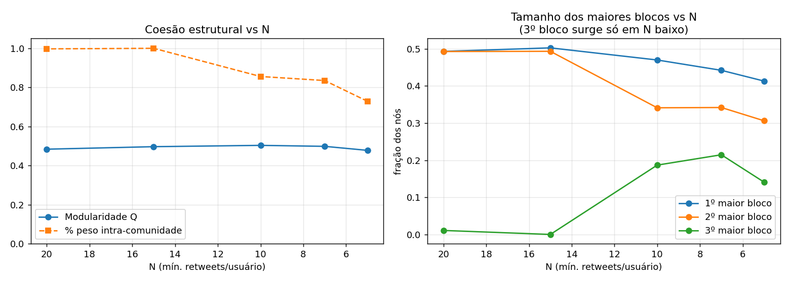
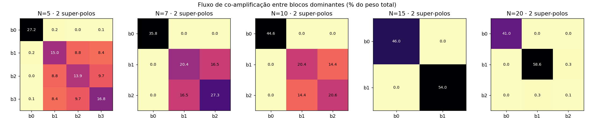
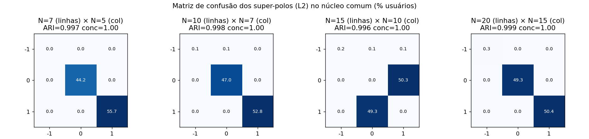
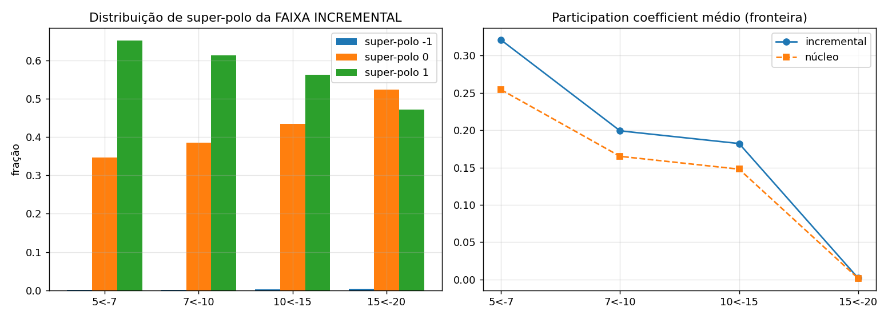

# Relatório de sensibilidade do parâmetro N (metade estrutural)

> **Evento:** `invasao-3-poderes` (ataques de 8 de janeiro de 2023).
> **Data do relatório:** 2026-06-19.
> **Escopo:** decidir se — e como — a **macroestrutura de comunidades** do grafo de
> co-retweet depende do filtro de atividade N (mínimo de retweets por usuário). A
> metade **ideológica** da decisão (qual N separa esquerda/direita mais nítido)
> depende da hidratação/classificação, ainda não construída, e fica **fora** deste
> relatório.
> **Reprodução:** `scripts/sensitivity_N.py`; registro append-only em
> `docs/analises-sensibilidade.md` (E9–E11); design em
> `docs/superpowers/specs/2026-06-19-sensibilidade-N-design.md`.

---

## 1. Resumo executivo

- **A bipolaridade macro é invariante a N.** Colapsando cada partição em **super-polos
  por fluxo de co-amplificação**, todo N de 5 a 20 produz **exatamente 2 super-polos**, e
  os usuários do núcleo comum **mantêm seu super-polo** ao mudar N com **ARI 0,993–0,999 /
  concordância 0,997–0,999** — *no nível do piso de ruído do próprio Leiden* (0,995–1,000).
  A representatividade está, portanto, **resolvida no nível que importa**: adicionar ou
  remover a periferia de baixa atividade **não** reorganiza os dois polos.
- **O que muda com N é a mesoestrutura, não o macro.** O número de blocos *nativos* do
  Leiden cai de **4 (N=5) → 3 (N=7, N=10) → 2 (N=15, N=20)**: um sub-bloco de ~15–20%
  *dentro de um dos super-polos* só fica visível em N baixo. Esse é exatamente o sinal que
  o ARI da partição cheia (0,759 entre N=5 e N=10, registrado em E4) media — e este
  relatório mostra que ele é **meso**, não macro.
- **Subir N = a mesma estrutura, mais nítida.** A coesão interna (peso intra-comunidade)
  sobe de **0,73 (N=5) para ~1,0 (N=15–20)**; a modularidade fica estável (Q ≈ 0,48–0,50)
  em toda a faixa.
- **Os usuários de baixa atividade que entram ao baixar N se encaixam nos 2 super-polos
  existentes** (resíduo < 0,5%, nenhuma comunidade nova), apenas com tendência de **fronteira
  um pouco maior** (mais "ponte") — o que produz a fragmentação meso, não polos novos.
- **Recomendação: N = 10** como ponto de operação (joelho da curva de tratabilidade,
  5,66M arestas renderáveis, preserva o 3º bloco meso que N≥15 destrói, captura ~47% do
  volume bruto de retweets). **N = 7** (ponto de trabalho atual) é **estruturalmente
  equivalente** e captura mais cobertura (55%), ao custo de ~2× arestas. A decisão é segura
  porque o **macro independe de N**; ela deve ser **revalidada contra a classificação
  ideológica** quando o módulo existir.

---

## 2. Método

- **Grid:** N ∈ {5, 7, 10, 15, 20}, com τ = 0,10 e `resolution` = 1,0 **fixos** (isolar o
  eixo N). N=3 fica fora (≈125M arestas, intratável; ver E1/E2).
- **Pipeline real, não reimplementação.** Cada N roda os módulos de produção
  (`NoiseFilter → BipartiteBuilder → JaccardProjector → CommunityDetector`). A única troca é
  uma projeção Jaccard *memory-lean* (int32/float32), **validada aresta-a-aresta como
  idêntica** ao `JaccardProjector` em N=10 (mesmos 22.097 nós / 5.661.890 arestas; erro
  relativo de peso máx. 5,9·10⁻⁸, só arredondamento float32). N=7 reproduz os artefatos em
  disco (33.305 nós, 12,0M arestas, Q = 0,498).
- **Rótulo macro em dois níveis**, derivados da partição **nativa** (γ=1,0):
  - **L3 — blocos nativos:** os blocos dominantes (≥ 1% dos nós) por tamanho; resíduo (< 1%)
    é categoria à parte.
  - **L2 — super-polos por fluxo:** componentes conexos dos blocos dominantes sob a relação
    "fluxo mútuo ≥ θ·min(peso interno dos dois)", θ = 0,10. Em N=10 reproduz
    `{com1} | {com0, com2}` (leitura do E8) e bate com o split de γ=0,5 do E6 (verificação
    cruzada). O número de super-polos é **determinado pelos dados**, não imposto. Robusto a
    θ ∈ {0,05; 0,20} (mesmos 2 super-polos em todo N).
- **Comparação entre Ns:** o núcleo comum é a **interseção dos conjuntos de nós dos dois
  backbones** (não "todos os usuários do N maior" — ver §2 do design: um usuário pode
  sobreviver em N=10 e ficar isolado em N=15). Métricas: **ARI, NMI, VI** (via
  `igraph.compare_communities`, invariantes a permutação) + **matriz de confusão** com
  alinhamento guloso e **taxa de concordância**. Tudo lido contra o **piso de ruído** do
  Leiden (duas execuções no mesmo grafo, por N).

---

## 3. Peça 1 — Trajetória estrutural

| N | nós | arestas | Q | nº com. | blocos dom. (≥1%) | super-polos | intra-peso | tamanhos dom. |
|---|---|---|---|---|---|---|---|---|
| 5 | 48.206 | 27.052.420 | 0,478 | 6 | **4** | **2** | 0,729 | [41%, 31%, 14%, 14%] |
| 7 | 33.305 | 12.023.243 | 0,498 | 12 | **3** | **2** | 0,835 | [44%, 34%, 21%] |
| 10 | 22.097 | 5.661.890 | 0,503 | 14 | **3** | **2** | 0,856 | [47%, 34%, 19%] |
| 15 | 13.171 | 2.605.419 | 0,497 | 16 | **2** | **2** | 1,000 | [50%, 49%] |
| 20 | 8.811 | 1.545.276 | 0,484 | 13 | 3* | **2** | 0,997 | [49%, 49%, 1%] |

\* em N=20 o "3º bloco" tem só 1,1% — está no limiar de 1%; efetivamente são 2 blocos.

**Leitura.** A modularidade é estável (Q ≈ 0,48–0,50): há estrutura forte em todo N. Duas
coisas mudam de forma ordenada conforme se **baixa** N (adiciona-se periferia):
1. **A nitidez cai:** o peso intra-comunidade vai de ~1,0 (N≥15) para 0,73 (N=5) — em N baixo
   há mais arestas cruzando blocos.
2. **A mesoestrutura fragmenta:** um dos polos se subdivide — 2 blocos (N≥15) → 3 (N=7,10) →
   4 (N=5). **Mas o número de super-polos é sempre 2.**

---

## 4. Peça 2 — Estabilidade macro (teste decisivo)

Para cada par (N maior `hi`, N menor `lo`), no núcleo comum:

| hi | lo | nós comuns | **L2 ARI** | L2 NMI | L2 conc. | **L3 ARI** | L3 conc. | piso ARI (hi/lo) |
|---|---|---|---|---|---|---|---|---|
| 7 | 5 | 33.305 | **0,997** | 0,991 | 0,999 | 0,764 | 0,799 | 0,995 / 0,999 |
| 10 | 5 | 22.097 | **0,996** | 0,987 | 0,998 | **0,759** | 0,769 | 0,999 / 0,999 |
| 10 | 7 | 22.097 | **0,998** | 0,991 | 0,999 | 0,944 | 0,974 | 0,999 / 0,995 |
| 15 | 5 | 13.171 | **0,993** | 0,980 | 0,997 | 0,699 | 0,739 | 1,000 / 0,999 |
| 15 | 7 | 13.171 | **0,995** | 0,984 | 0,997 | 0,795 | 0,861 | 1,000 / 0,995 |
| 15 | 10 | 13.171 | **0,996** | 0,986 | 0,998 | 0,785 | 0,848 | 1,000 / 0,999 |
| 20 | 5 | 8.811 | **0,994** | 0,982 | 0,997 | 0,716 | 0,787 | 1,000 / 0,999 |
| 20 | 7 | 8.811 | **0,995** | 0,984 | 0,998 | 0,801 | 0,873 | 1,000 / 0,995 |
| 20 | 10 | 8.811 | **0,996** | 0,988 | 0,998 | 0,787 | 0,858 | 1,000 / 0,999 |
| 20 | 15 | 8.811 | **0,999** | 0,995 | 0,999 | 0,977 | 0,989 | 1,000 / 1,000 |

**Leitura.**
1. **L2 (super-polos) é invariante a N.** ARI 0,993–0,999 e concordância ≥ 0,997 em **todos**
   os pares — **igual ao piso de ruído** do Leiden. Até o par extremo (N=5 vs N=20) dá ARI
   0,994. Os usuários **não migram de polo** quando o filtro muda. **H0 confirmada no nível
   macro.**
2. **L3 (blocos nativos) reproduz o sinal da partição cheia.** O par N=10 vs N=5 dá L3 ARI =
   **0,759** — exatamente o ARI da partição completa registrado em E4. Ou seja: a
   "instabilidade" que E4 observou é **inteiramente meso** (a subdivisão de um polo), com o
   macro intacto (L2 = 0,996 no mesmo par). O ARI L3 degrada quando o par cruza o regime
   (≤10 vs ≥15), onde o 3º bloco aparece/some, e fica alto entre Ns do mesmo regime
   (10 vs 7 = 0,944; 20 vs 15 = 0,977).

Isto fecha a pendência do "teste de estabilidade macro" e a ressalva aberta de E4.

---

## 5. Peça 3 — Faixa incremental (o que os menos ativos fazem)

Para cada degrau adjacente, a "faixa incremental" são os usuários presentes no backbone de
N menor e ausentes no de N maior (os que entram ao afrouxar o filtro):

| degrau | entram | dist. super-polo (incr.) | dist. super-polo (núcleo) | resíduo (incr.) | participation incr. / núcleo |
|---|---|---|---|---|---|
| 5 ← 7 | +14.901 | 35% / 65% | 44% / 56% | 0,04% | **0,32 / 0,25** |
| 7 ← 10 | +11.208 | 39% / 61% | 47% / 53% | 0,07% | **0,20 / 0,17** |
| 10 ← 15 | +8.926 | 44% / 56% | 49% / 50% | 0,18% | **0,18 / 0,15** |
| 15 ← 20 | +4.360 | 52% / 47% | 49% / 50% | 0,41% | 0,002 / 0,001 |

**Leitura.** Os usuários de baixa atividade que entram ao baixar N **se distribuem pelos 2
super-polos já existentes** — com resíduo desprezível (< 0,5%), **sem formar comunidade
nova**. Sua única diferença sistemática é uma **fronteira maior** (participation coefficient
acima do núcleo, crescente conforme N cai): são estruturalmente mais "ponte". É essa
ponticidade dos menos ativos que **borra a fronteira meso** (gera os sub-blocos extras de
N baixo), sem nunca criar um terceiro polo. Confirma a leitura **B** da pergunta de pesquisa.

---

## 6. Síntese e recomendação de N

Cruzando os eixos (tratabilidade/volume de E2/E3 com a estabilidade deste relatório):

| N | nós backbone | arestas | retweets (% bruto) | nº blocos meso | macro | tratável/renderável? |
|---|---|---|---|---|---|---|
| 5 | 48.206 | 27,1M | 62,7% | 4 | 2 polos | pesado (viz difícil) |
| 7 | 33.305 | 12,0M | 55,3% | 3 | 2 polos | ok (viz pesada) |
| **10** | **22.097** | **5,66M** | **47,3%** | **3** | **2 polos** | **bom (joelho)** |
| 15 | 13.171 | 2,61M | 37,9% | 2 | 2 polos | ótimo |
| 20 | 8.811 | 1,55M | 31,2% | 2 | 2 polos | ótimo |

Como o **macro (2 polos) é o mesmo em toda a faixa**, a escolha de N deixa de ser uma questão
de representatividade e passa a ser um trade-off de **granularidade meso × cobertura ×
tratabilidade/renderização**:

- **N = 10 (recomendado).** Joelho da curva de arestas (E2): 5,66M arestas — renderável no
  Sigma.js. Preserva um 3º bloco meso de ~19% (potencialmente uma sub-facção de interesse)
  que N≥15 dissolve. Captura ~metade do volume de retweets. Macro idêntico aos demais.
- **N = 7 (alternativa equivalente, ponto atual).** Mais cobertura (55% do volume, 33k nós) e
  3º bloco um pouco maior (21%), ao custo de ~2× arestas (12,0M) — viz mais pesada. Sem
  diferença macro.
- **N = 5 — não recomendado como operação.** 27M arestas dificultam Leiden/visualização, e o
  4º bloco (~14%) provavelmente reflete *bursts* densos de baixa atividade (alta ponticidade,
  E11) mais que substância. Valioso apenas como **âncora inferior** da sensibilidade.
- **N ≥ 15 — não recomendado se o 3º bloco interessa.** Troca a mesoestrutura por economia
  marginal de compute; colapsa os dois sub-blocos num só.

---

## 7. Ressalvas e pendências

1. **Metade ideológica (decisiva para fechar N).** Este relatório resolve a metade
   *estrutural*. *Qual* dos 2 super-polos é esquerda e qual é direita, e se o 3º bloco meso é
   uma sub-facção de um lado ou um terceiro ator, só a **classificação ideológica** (módulo de
   hidratação, ainda não construído) responde. O N escolhido deve ser revalidado lá: a
   separação esquerda/direita deve ser estável e nítida no N de operação.
2. **τ fixo em 0,10.** A sensibilidade a τ (0,05/0,10/0,15) é pendência separada; parte do
   isolamento absoluto entre polos é efeito do backbone (ver E8).
3. **Um evento.** Toda a análise é do 8 de janeiro. E2–E5 e este estudo precisam ser repetidos
   nos outros três eventos antes de generalizar.
4. **Métrica de atividade.** O `wdeg` reportado é grau ponderado (Jaccard), medida estrutural,
   não contagem de retweets; a atividade da faixa incremental está definida pela banda de N.
